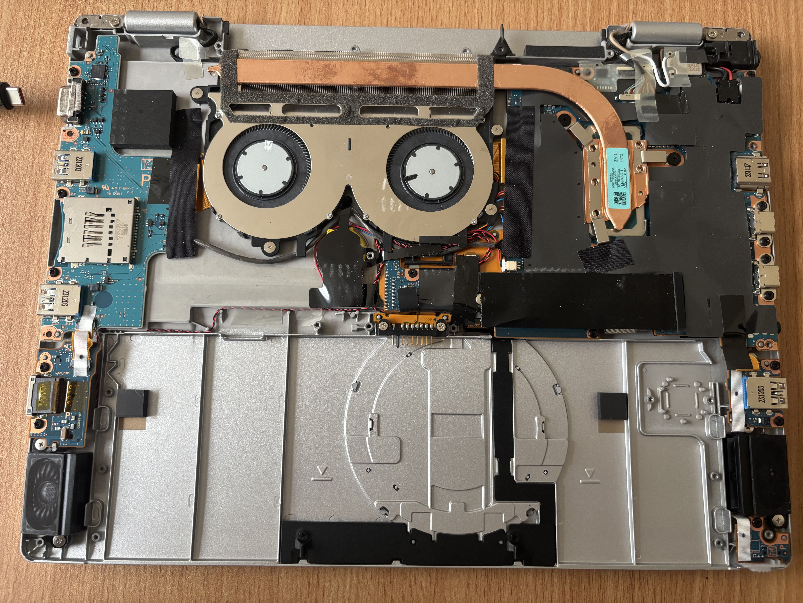
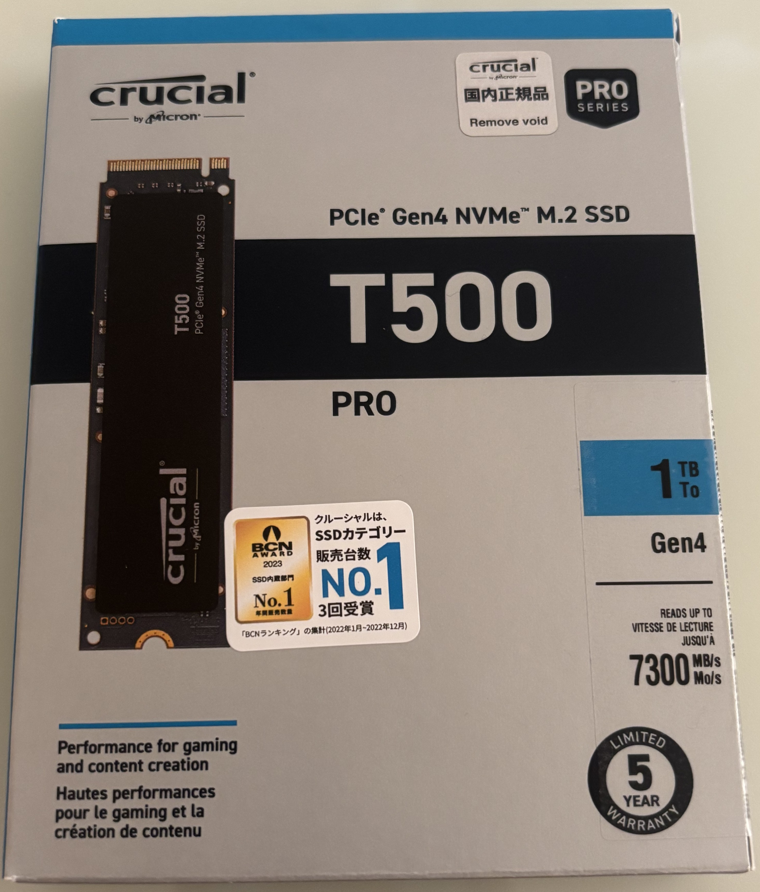
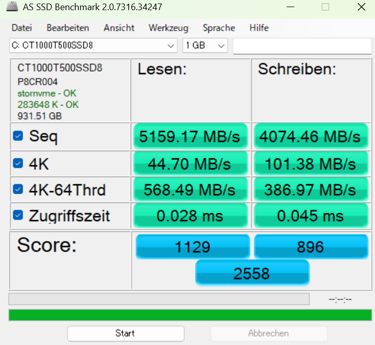

## はじめに

　生協モデルCF-FV4のSSDが256GBしかなく、Linuxとのデュアルブートやサイズの大きいソフトウェアがやや窮屈であった。そこで、思い切って1TBに換装した。この記事では、一連の流れをざっくりと説明していく。

## 分解とSSDの取り外し

　分解方法は[こちら](https://shop.applied-net.co.jp/blog/cate_news/22935/)のサイトを参考にした。
Windowsの再インストール方法などは記載されていなかったので、この記事では詳細を補足していく。


_CF-FV4の内部。中央やや右に黒いフィルムで覆われたSSDが見える。_

　分解作業は比較的簡単である。特に難しいポイントはないが、ネジをなめないように注意したい。シールが貼られている部分については、上記のリンク先を参考に、きれいにずらして外すと元のようにきれいに戻せる。

　ネジを外してカバーを開けると、すぐに内部とご対面。黒いフィルムに元のSSDについていたシールが貼りついて取れないが、そのまま使う。

　今回使用したSSDは「Crucial T500 1TB」。もともと入っていたSSDはSAMSUNG製のPCIe 4.0のM.2 NVMe 片面実装SSD。先ほど述べたように、型番のシールの印刷面が黒いフィルムに貼り付いて見えなかったが、Windowsに接続して確認予定。


_今回換装したCrucial T500 1TB。_

　Crucial T500は2025年12月現在、Crucialの一般向けの販売撤退によって高騰している。全体的なSSDやメモリについてもAI関連の需要などで高騰している。

[Amazonで「SSD」を見る](https://amzn.to/3HWh1dw)

## Windows11の再インストール

　SSD交換後は、Windowsの再インストールが必要である。
CF-FV4には、SSDとは別に回復領域が用意されていないため、交換前に必ず回復ドライブを作成しておく必要がある。

　回復ドライブの作成は、Windowsの設定から「更新とセキュリティ」→「回復」→「回復ドライブの作成」で行える。
現在ではWindows11の回復ドライブは32GB以上のUSBが推奨である。

　私はKIOXIAの64GB USBメモリを使用した。32GBのパーティションで区切られるので、32GBで十分である。珍しくヤマダ電機でセールになっていてamazonより安かったので購入。先ほど述べたSSDやメモリと同様、USBメモリについても高騰しているので、早く安くなることを期待したい。

　Amazonのアフィリエイトリンクを以下に貼る。KIOXIAのものは国産かつ安くてちゃんとしているので、パソコンオタクは複数持っていがちである。

[Amazonで「USBメモリ」を見る](https://amzn.to/3JH4XNF)

　回復ドライブを作成したら、SSD交換後のCF-FV4に接続して電源を入れる。電源を入れたらすぐにF2を連打し、UEFIに入る。UEFI設定でUSBから起動するようにする。
その後、回復ドライブからWindowsのインストールを行う。
インストールは指示に従うだけで完了する。

## 交換後のベンチマーク

交換後のSSDの速度は以下の通りであった。

```text
Read: 5,159 MB/s
Write: 4,074 MB/s
```


_今回換装したCrucial T500 1TB。_

_Crucial T500 1TBのベンチマーク結果。_

交換前のSSDと比べて、読み書き速度が大きく向上したと思われる。
大きなデータを扱うときは早くなった気もする。

## まとめ

SSDの容量が増えたことで、CF-FV4がより快適に使えるようになった。
大学だけで使うなら標準容量でも十分だが、デュアルブートかつ、いろいろなソフトを入れたい自分には1TBが快適であった。

CF-FV4を使っていてSSD容量に不満がある人はやってみてもいいのではないだろうか。SSDが再び安くなることを祈る。
